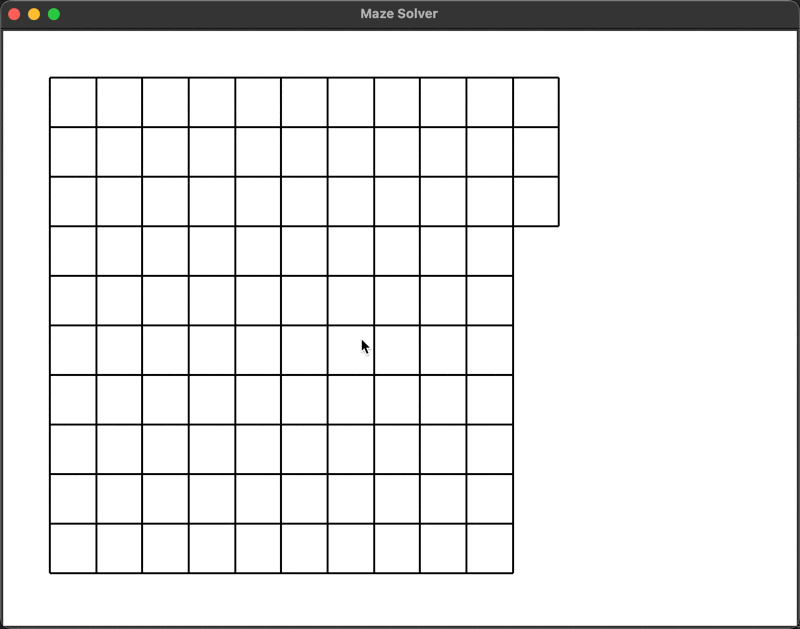

# Maze Solver

A visual interface that draws, solves, and animates a maze in Python.

The program draws a randomized maze and then systematically solves it.

Technologies used:
- Python (version 3.10+)
- Tkinter



## Tkinter

Check if Tkinter is installed:

```bash
python3 -m tkinter
```

If Tkinter isn't working try installing it via package manager (brew for MacOS):

```bash
brew install python-tk@VERSION
```

`python-tk` is the Python interface to `Tcl/Tk` which enables to build (rebuild) Python with explicitly built-in Tkinter.

Example solution for existing Python 3.13.x managed via `pyenv`:

```bash
brew install python-tk@3.13
pyenv uninstall 3.13.x
pyenv install 3.13.x
```

Uninstalling `python-tk@3.13` removes ability for Python to work with Tkinter, so keep this formulae while working with the project.

Also, you can try to install Python from the [source](https://www.python.org/downloads/).